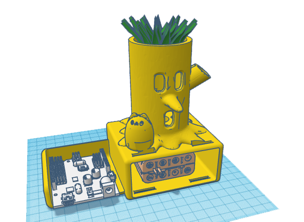
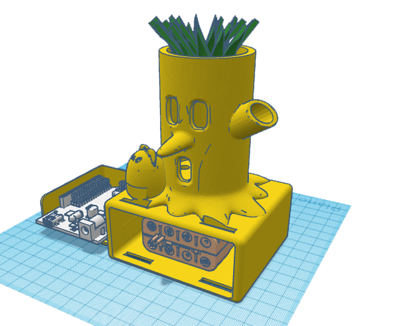
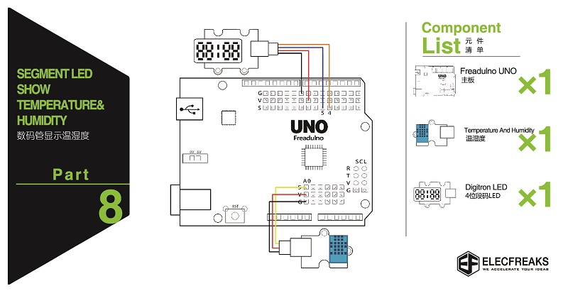

# ArduinoPlantBot
Modelo sencillo de PlantaBot con Arduino 

PlantBot es un robot que nos permitirá cuidar de nuestra planta pudiendo medir la temperatura y la humedad. La información de la humedad y temperatura aparecerá en una pantalla y así sabremos si nuestra planta necesita más agua o necesitamos ponerla en un lugar más frio o más caliente.

	
	

**IMPORTANTE**: Recomendamos introducir la planta en una maceta para evitar acumular el agua en la parte de abajo. Una buena práctica es usar un tubo para drenar el agua que sobra por el agujero en la parte trasera del modelo.

# Montaje

Lo primero que deberemos hacer será atornillar la placa Arduino a nuestra pieza. De esta manera evitaremos que se mueva. Esto lo podemos conseguir insertando como mínimo 2 tornillos de métrica 3 sobre los agujeros específicamente diseñados para ello.

Si queremos usar nuestro robot de manera independiente deberemos comprar un portapilas para conectar a la entrada de alimentación de nuestra placa.
Para ello, hemos dejado un hueco en la parte de abajo donde podremos guardar las pilas entre otras cosas.

# Electrónica

La electrónica de cada elemento se puede conectar fácilmente siguiendo la regla de los colores.

El cable negro ( GND ) y el cable rojo ( VCC ) se han de conectar al pin negro y al pin rojo de nuestra placa respectivamente. El cable amarillo, será el pin que controlará la señal de los sensores y también hay que conectarlo al pin amarillo.

Deberemos conectar los siguientes elementos 
- El sensor de temperatura.
- El sensor de humedad.
- El display numérico.

	

# Programación
En esta sección explicaremos en que se basa cada una de las secciones de código que vamos a utilizar para desarrollar nuestro robot.

## Iniciar el Display

## Medir la temperatura y la Humedad del Aire

## Medir la humedad del suelo

## Instalar Arduino
Para programar nuestro robot, será necesario instalar Arduino.
Aunque pueda parecer un poco complicado, solo tendremos que realizar este proceso una vez y cuando hayamos instalado todos los programas para crear nuestro robot, el resto es pan comido.

Nuestra placa programables es una placa Arduino, para ello deberemos descargar un programa para desarrollar el código necesario de nuestro robot en la siguiente página web.